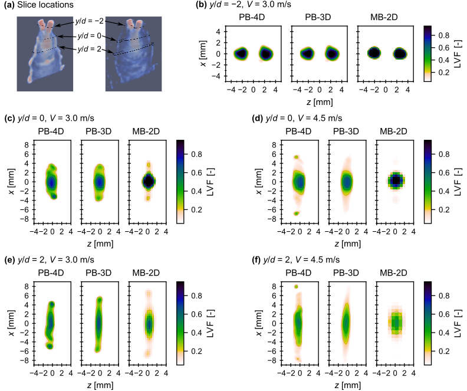

# Analytical workflow for X-ray tomography of liquid jet breakup dynamics
   

**Author**: Naveed Rahman 

This repo contains the scripts required for tomographic reconstructions of the liquid spray datasets showcased in the manuscript entitled "Quantitative polychromatic 4D and monochromatic 2D X-ray tomography of liquid jet breakup dynamics."

|  | 
|:--:| 
| *Slice-based comparisons of tomographic reconstructions of an impinging jet spray using a temporally-resolved polychromatic beam setup (PB-4D), temporally averaged polychromatic beam setup (PB-3D), and a temporally averaged monochromatic beam setup (MB-2D). For further detail, refer to the accompanying journal publication.* |

## Project Setup
The analyses shown here walk the user through how to obtain quantitative temporally resolved volumetric reconstructions (4D) of liquid mass distribution in an impinging jet spray using a full-view cone beam tube source radiography imaging experimental setup (labelled as polychromatic beam, **PB**) and quantitative temporally averaged planar reconstructions (2D) of liquid mass distributions from the same spray using a focused parallel beam synchrotron source scanning experimental setup (labelled as monochromatic beam, **MB**). A small subset of the experimental data is included in the `inputs` folder to serve as a showcase for how the analyses are carried out—all raw datasets collected in this work are archived separately (DOI: [10.4231/G20X-4Z27](https://doi.org/10.4231/G20X-4Z27)).

The workflow in this project is split between high-level Jupyter notebooks (\*.ipynb) that serve as a detailed guide on how the analysis is done on the relevant datasets and low-level Python scripts (\*.py) that do the bulk of the actual computations. The entire repo can be downloaded to be run locally, however pre-computed static renders through [nbviewer.org](https://nbviewer.org) and interactive notebooks through [mybinder.org](https://mybinder.org) (may take a while to load!) are available below through the clickable badges.

### Monochromatic Beam (MB) Processing
The workflow for quantitative tomographic reconstructions of the MB datasets is fully contained within the one notebook. The datasets for this workflow are the `*monochromatic*` files in the `inputs` folder.

| File | Description | Static | Interactive |
| ---  | --          | ---    | ---         |
| [mb_processing.ipynb](./mb_processing.ipynb) | Full processing notebook for the MB datasets. |  |  |
| [mb_utilities.py](./mb_utilities.py) | Python functions used in the MB notebook. | - | - |

### Polychromatic Beam (PB) Processing
The workflow for quantitative tomographic reconstructions of the PB datasets is split between multiple notebooks that are to be run in the order below. The datasets for this workflow are the `*polychromatic*` files in the `inputs` folder. Due to the requirement of a GPU for 3D reconstruction, only a previously run static view is shown for the refinement step—the interactive view for the reconstruction notebook loads in previously computed results purely for visualization.

| File | Description | Static | Interactive |
| ---  | --          | ---    | ---         |
| [pb01_calibration.ipynb](./pb01_calibration.ipynb) | Initial camera calibration using dot targets. |  |  |
| [pb02_preprocessing.ipynb](./pb02_preprocessing.ipynb) | Conversion of radiographs into projected density. |  |  |
| [pb03_refinement.ipynb](./pb03_refinement.ipynb) | Tomography-based calibration refinement. |  | - |
| [pb04_reconstruction.ipynb](./pb04_reconstruction.ipynb) | Volume reconstruction of the 2D projections. |  |  |
| [calib_utilities.py](./calib_utilities.py) | Python functions for PB camera calibration. | - | - |
| [preproc_utilities.py](./preproc_utilities.py) | Python functions for PB image pre-processing. | - | - |
| [refine_utilities.py](./refine_utilities.py) | Python functions for PB calibration refinement. | - | - |
| [recon_utilities.py](./recon_utilities.py) | Python functions for PB volume reconstruction. | - | - |

## Requirements
The Python packages used and version information for each are detailed within the Jupyter notebooks. The cone beam reconstructions implemented through the ASTRA toolbox (https://www.astra-toolbox.com) require the use of an NVIDIA GPU. Due to the use of an out-dated GPU (see [Hardware Information](#hardware-information)), the PB reconstruction scripts utilized v1.8.3 of the *ASTRA* toolbox, however the MB reconstruction script requires v >= 2.0.0 of the *ASTRA* toolbox to use the newer rotation offset functionality and was therefore run on the CPU instead in a separate Python environment. Depending on your hardware configuration, you may be able to process all notebooks/scripts without need of separate environments.

## Hardware Information
|     |     |
| --- | --- |
| Python implementation | CPython |
| Python version | 3.7.7 |
| IPython version | 7.29.0 |
| Compiler | GCC 7.3.0 |
| OS | Linux |
| Release | 4.4.0-21390-Microsoft |
| CPU | Intel(R) Core(TM) i7-6700 CPU @ 3.40GHz |
| CPU cores | 8 |
| Architecture | 64bit |
| RAM |	16.0 GB |
| GPU | NVIDIA Quadro 600 |
| CUDA version | 8.0 |
| CUDA compute capability | 2.1 |

## Related Works
1. Rahman, N., Halls, B. R., Kastengren, A. L., Roy, S., Meyer, T. Quantitative polychromatic 4D and monochromatic 2D X-ray tomography of liquid jet breakup dynamics. *To be submitted*.
2. Rahman, N. X-ray radiography datasets for tomographic reconstruction of liquid jet breakup dynamics. *Purdue University Research Repository* (2022). doi: [10.4231/G20X-4Z27](https://doi.org/10.4231/G20X-4Z27).

## References
1. van Aarle, W. et al. The ASTRA Toolbox: A platform for advanced algorithm development in electron tomography. *Ultramicroscopy* 157, 35–47 (2015). doi: [10.1016/j.ultramic.2015.05.002](https://doi.org/10.1016/j.ultramic.2015.05.002).
2. van Aarle, W. et al. Fast and flexible X-ray tomography using the ASTRA toolbox. *Opt. Express* 24, 25129 (2016). doi: [10.1364/OE.24.025129](https://doi.org/10.1364/OE.24.025129).
3. Jingyu Cui, Pratx, G., Bowen Meng & Levin, C. S. Distributed MLEM: An Iterative Tomographic Image Reconstruction Algorithm for Distributed Memory Architectures. *IEEE Trans. Med. Imaging* 32, 957–967 (2013). doi: [10.1109/TMI.2013.2252913](https://doi.org/10.1109/TMI.2013.2252913).
4. Slomski, A. et al. 3D PET image reconstruction based on the maximum likelihood estimation method (MLEM) algorithm. *Bio-Algorithms and Med-Systems* 10, 1–7 (2014). doi: [10.1515/bams-2013-0106](https://doi.org/10.1515/bams-2013-0106).
5. Atkinson, C. & Soria, J. An efficient simultaneous reconstruction technique for tomographic particle image velocimetry. *Exp. Fluids* 47, 553–568 (2009). doi: [10.1007/s00348-009-0728-0](https://doi.org/10.1007/s00348-009-0728-0).
6. Worth, N. A. & Nickels, T. B. Acceleration of Tomo-PIV by estimating the initial volume intensity distribution. *Exp. Fluids* 45, 847–856 (2008). doi: [10.1007/s00348-008-0504-6](https://doi.org/10.1007/s00348-008-0504-6).
7. Shekhar, C. On simplified application of multidimensional Savitzky-Golay filters and differentiators. in *AIP Conference Proceedings* 020014 (2016). doi: [10.1063/1.4940262](https://doi.org/10.1063/1.4940262).
8. Zhang, Z. A flexible new technique for camera calibration. *IEEE Trans. Pattern Anal. Machine Intell.* 22, 1330–1334 (2000). doi: [10.1109/34.888718](https://doi.org/10.1109/34.888718).
9. *OpenCV*. Available at: https://docs.opencv.org/3.2.0/d9/d0c/group__calib3d.html.
10. Rahman, N. X-ray radiography datasets for tomographic reconstruction of liquid jet breakup dynamics. *Purdue University Research Repository* (2022). doi: [10.4231/G20X-4Z27](https://doi.org/10.4231/G20X-4Z27).
11. Halls, B. R. et al. Quantitative 10-50 kHz X-ray radiography of liquid spray distributions using a rotating-anode tube source. *Int. J. Multiphas. Flow* 109, 123–130 (2018). doi: [10.1016/j.ijmultiphaseflow.2018.07.014](https://doi.org/10.1016/j.ijmultiphaseflow.2018.07.014).
12. Albiol, F., Corbi, A. & Albiol, A. Evaluation of modern camera calibration techniques for conventional diagnostic X-ray imaging settings. *Radiol Phys Technol* 10, 68–81 (2017). doi: [10.1007/s12194-016-0369-y](https://doi.org/10.1007/s12194-016-0369-y).
13. Li, X., Zhang, D. & Liu, B. A generic geometric calibration method for tomographic imaging systems with flat-panel detectors-A detailed implementation guide: Geometric calibration method for tomographic imaging systems. *Med. Phys.* 37, 3844–3854 (2010). doi: [10.1118/1.3431996](https://doi.org/10.1118/1.3431996).
14. Kennedy, J. & Eberhart, R. Particle swarm optimization. in *Proceedings of ICNN’95 - International Conference on Neural Networks* vol. 4 1942–1948 (IEEE, 1995). doi: [10.1109/ICNN.1995.488968](https://doi.org/10.1109/ICNN.1995.488968).
15. James V. Miranda, L. PySwarms: a research toolkit for Particle Swarm Optimization in Python. *JOSS* 3, 433 (2018). doi: [10.21105/joss.00433](https://doi.org/10.21105/joss.00433).
16. Abdel-Basset, M., Abdel-Fatah, L. & Sangaiah, A. K. Metaheuristic Algorithms: A Comprehensive Review. in *Computational Intelligence for Multimedia Big Data on the Cloud with Engineering Applications* 185–231 (Elsevier, 2018). doi: [10.1016/B978-0-12-813314-9.00010-4](https://doi.org/10.1016/B978-0-12-813314-9.00010-4).
17. Jingyu Cui, Pratx, G., Bowen Meng & Levin, C. S. Distributed MLEM: An Iterative Tomographic Image Reconstruction Algorithm for Distributed Memory Architectures. *IEEE Trans. Med. Imaging* 32, 957–967 (2013). doi: [10.1109/TMI.2013.2252913](https://doi.org/10.1109/TMI.2013.2252913).
18. Slomski, A. et al. 3D PET image reconstruction based on the maximum likelihood estimation method (MLEM) algorithm. *Bio-Algorithms and Med-Systems* 10, 1–7 (2014). doi: [10.1515/bams-2013-0106](https://doi.org/10.1515/bams-2013-0106).
19. *ParaView*. Available at: http://www.paraview.org/.
20. Schroeder, W., Martin, K. & Lorensen, B. *The Visualization Toolkit*. (Kitware, Inc, 2006).
